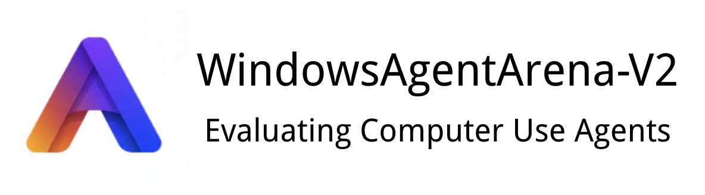

<div align="center">
    

[](https://gair-nlp.github.io/PC-Agent-E/)
[](https://arxiv.org/abs/2505.13909)
[](https://github.com/GAIR-NLP/PC-Agent-E)
[](https://github.com/GAIR-NLP/WindowsAgentArena-V2/blob/main/LICENSE)
</div>

**WindowsAgentArena-V2** is an updated benchmark for better evaluation of computer use agents in Windows, comprising 141 tasks
across 11 widely-used Windows applications, all derived from the original [WindowsAgentArena](https://github.com/microsoft/WindowsAgentArena) but with the following improvements:
- Addressing the evaluation dependency issue.
- Preventing infeasible hacking.
- Guaranteeing VM initial state stability.
- Fixing evaluation flaws.

For more details, please refer to our [paper](https://arxiv.org/abs/2505.13909).

## ☝️ Pre-requisites:

- Docker daemon installed and running. On Windows, we recommend using [Docker with WSL 2](https://docs.docker.com/desktop/wsl/).
- Python 3.10 - we recommend using [Conda](https://docs.conda.io/projects/conda/en/latest/user-guide/getting-started.html) and creating an adhoc python environment for running the scripts. For creating a new environment, run `conda create -n winarena python=3.10`.

Clone the repository and install dependencies:
```bash
git clone https://github.com/GAIR-NLP/WindowsAgentArena-V2.git
cd WindowsAgentArena-V2
# Install the required dependencies in your python environment
conda activate winarena
pip install -r requirements.txt
```

## 💻 Local deployment (WSL or Linux)

### 1. Configuration file
Prepare the `config.json` at the root of the project with the necessary keys and details:

```json
{
    "OPENAI_API_KEY": "EMPTY",  // API key for the agents
    "OPENAI_BASE_URL": "http://host.docker.internal:8030/v1",  // Base URL for the agents. Note: if you want to connect to host machine, use host.docker.internal instead of localhost
    "OPENAI_API_KEY_FOR_CHECK_SETUP": "sk-1234567890",  // OpenAI API key for GPT-4o used to check setup
    "OPENAI_BASE_URL_FOR_CHECK_SETUP": "https://api.openai.com/v1",  // OpenAI Base URL for GPT-4o used to check setup
    "model": "henryhe0123/PC-Agent-E",  // Model name for the agents
    "trial_id": 1,  // Trial ID
    "max_steps": 30,  // Maximum steps for evaluation
    "agent": "pcagent",  // Agent type for evaluation
    "CONCURRENT_NUM": 4  // Concurrent number for evaluation
}
```

### 2. Prepare the Windows Arena Docker Image

#### 2.1 Pull the WinArena-Base Image from Docker Hub

To get started, pull the base image from Docker Hub:

```bash
docker pull windowsarena/winarena-base:latest
```

This image includes all the necessary dependencies (such as packages and models) required to run the code in the `src` directory.

#### 2.2 Build the WinArena Image Locally

Next, build the WinArena image locally:

```bash
cd scripts
./build-container-image.sh
```

This will create the `windowsarena/winarena-v2:latest` image with the latest code from the `src` directory.

### 3. Prepare the Windows 11 VM

Before running the arena, you need to download our WAA-V2 snapshot from [here](https://huggingface.co/datasets/henryhe0123/WAA-V2-win11-snapshot). This 32GB snapshot represents a fully functional Windows 11 VM with all the programs needed to run the benchmark. This VM additionally hosts a Python server which receives and executes agent commands. 

For concurrent runs (e.g., `CONCURRENT_NUM = 4`), you need to make **4 copies** of the snapshot and put them in `src/win-arena-container/vm/storage_backup_{i}`, where i = 1, 2, 3, 4. Each concurrent environment needs its own snapshot copy.

<div align="center">
    
</div>
<br/>

You can monitor the virtual machine at `http://localhost:8006` after you starting running the program. 

### 4. Deploying the agent in the arena

#### 1. Preparing evaluation tasks

Before running the benchmark, you need to first prepare the tasks in `src/win-arena-container/client/evaluation_examples_windows/test_custom.json`.

#### 2. Running the benchmark

You're now ready to launch the evaluation, just do:

```bash
cd scripts
sudo ./run-restart-concurrent.sh
```

Notes:
1. Completed tasks are tracked in the results directory and will be skipped if they share the same trial ID. Only new tasks will be evaluated.
2. The program launches subprocesses for concurrent evaluation. To terminate subprocesses and stop evaluation, follow the instructions printed in the terminal (output from the main process).
3. Each task requires restarting the virtual machine, which may take a long time. During this process, you may see repeated messages like: `Waiting for a response from the Windows server. This might take a while...`.

#### Evaluation logs

The evaluation logs are saved in the `logs/` directory, structured as follows:
```
logs/
└── trial_1/
    ├── main.log
    ├── instance_1/
    │   ├── run1.log
    │   ├── run2.log
    │   └── run3.log
    ├── instance_2/
    │   ├── run1.log
    │   ├── run2.log
    │   └── run3.log
    └── ...
```

Note: Administrator privileges may be required to modify the `logs` directory.

#### Summarizing results

The results for each trial are saved in the `src/win-arena-container/client/results/<trial_id>/` directory.

To summarize the results, run the following command:

```bash
python count.py --trial_id <trial_id>  # --agent is optional, default is 'pcagent'
```

## 🤖 Bring Your Own Agent
Want to test your own agents in WindowsAgentArena-V2? You can use our default agent as a template and create your own folder under `src/win-arena-container/client/mm_agents`. You just need to make sure that your `agent.py` file features `predict()` and `reset()` functions.

## ❓ FAQ

#### How can I configure a proxy for the VM (e.g. if I'm behind the GFW)?

If you want to set up a proxy for the VM, you can do the following:
1. Configure a proxy on your host machine and add the environment variable `HTTPS_PROXY`.
2. Uncomment the proxy-related [section](https://github.com/GAIR-NLP/WindowsAgentArena-V2/blob/main/scripts/run.sh#L300) in the `invoke_docker_container` function within `scripts/run.sh`.

## 👏 Acknowledgements

- [WindowsAgentArena](https://github.com/microsoft/WindowsAgentArena) for the original version of WindowsAgentArena benchmark.
- [OSWorld](https://github.com/xlang-ai/OSWorld) for the reference computer use agent benchmark in Linux.

## 📚 Citation
Our paper about computer use agent training can be found [here](https://arxiv.org/abs/2505.13909).
If you find this environment useful, please consider citing our paper:
```
@misc{he2025efficientagenttrainingcomputer,
      title={Efficient Agent Training for Computer Use}, 
      author={Yanheng He and Jiahe Jin and Pengfei Liu},
      year={2025},
      eprint={2505.13909},
      archivePrefix={arXiv},
      primaryClass={cs.AI},
      url={https://arxiv.org/abs/2505.13909}, 
}
```